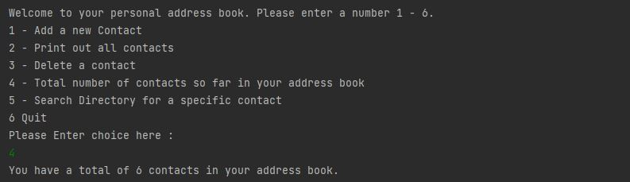

# Address Book

An address book, where a user can add, display contacts, search, show the number of contacts within their address book, and delete to the address book.

 

Adding first few entries to the address book

  

Size of Contact List

Deleting a Contact

  

Displaying all contacts in Address Book

Search Contact

